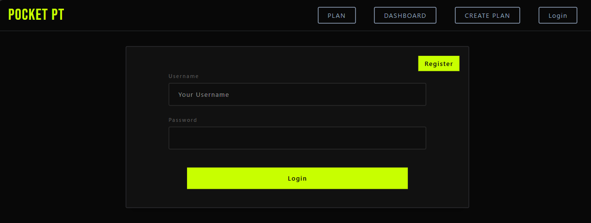
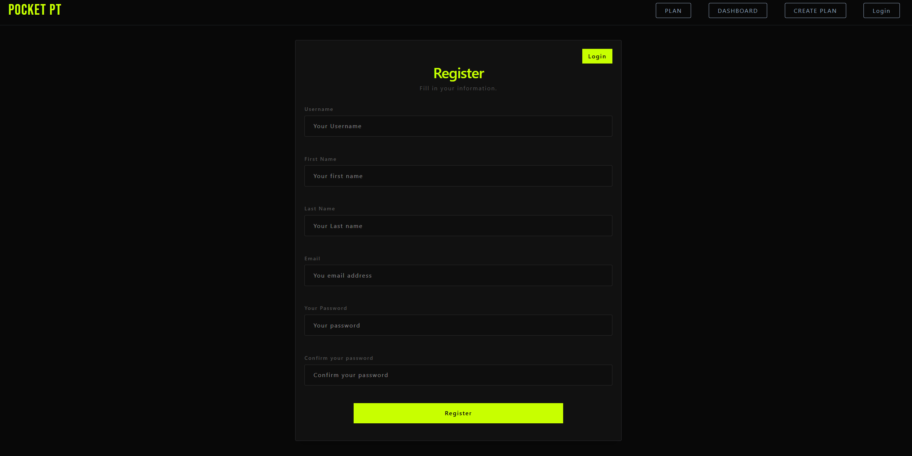
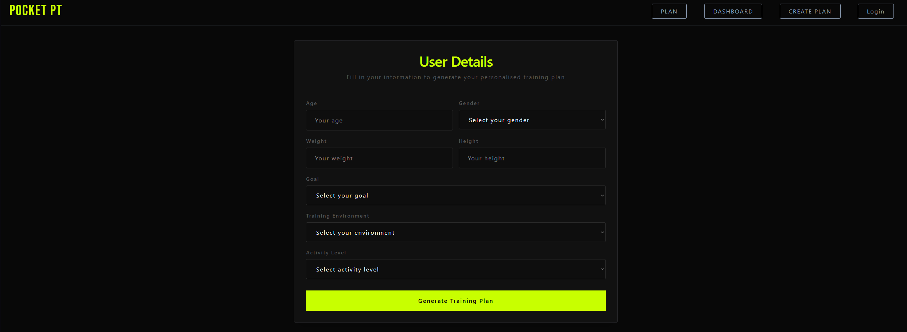
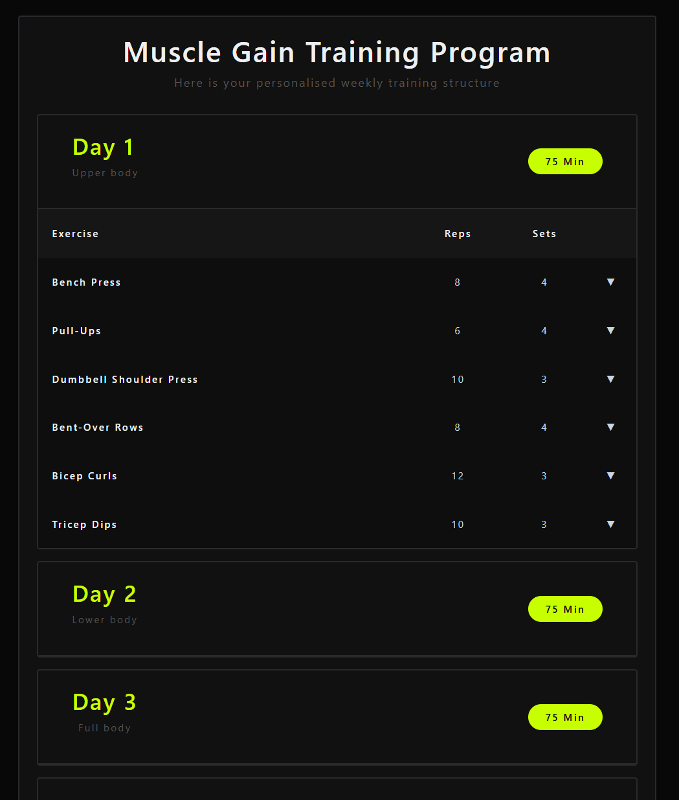
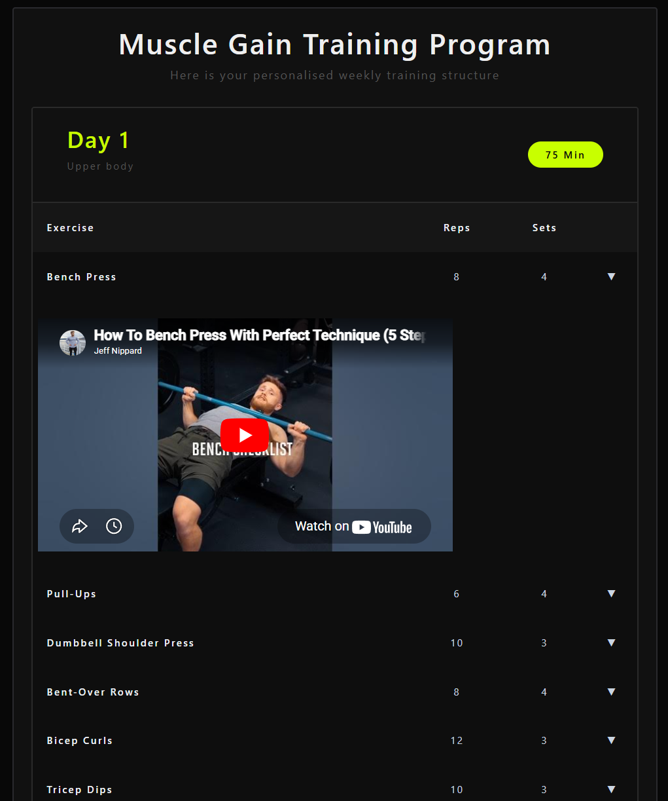
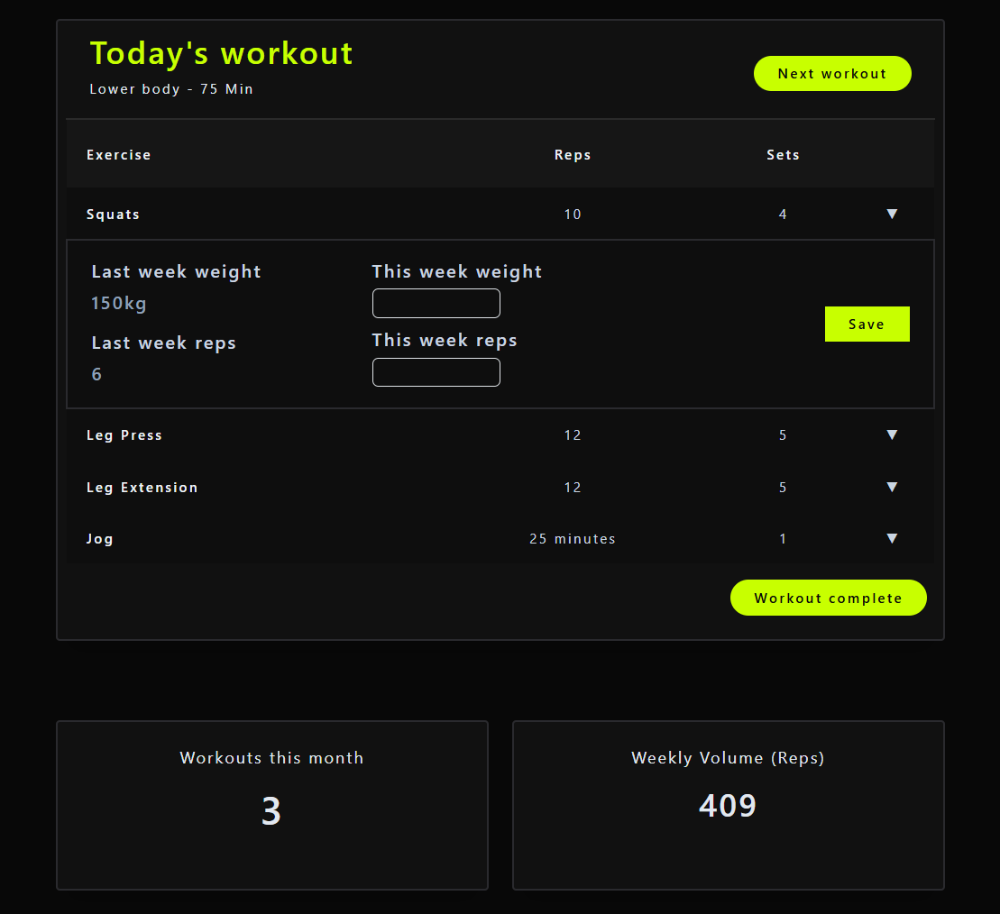

# PocketPT

PocketPT is an AI-powered personal training web app that generates personalised workout plans based on a user's goals, body data, activity level, and training environment.

Users can register, log in, enter their training details, generate a plan with AI, view their workouts, log exercise performance, and track simple training stats through a dashboard.

## Screen Shots
## Login


## Register


## User Form


## Training Plan


## Exercise Video


## Dashboard + tracking


## Live Demo Link
[PocketPT Live App](https://pocket-pt-kappa.vercel.app)
> Note: the backend is hosted on Render and may take around 1 minute to wake up after inactivity.

## Live Demo QR


> Note: the backend is hosted on Render and may take around 1 minute to wake up after inactivity.

## Tech Stack

### Frontend
- React
- TypeScript
- Vite
- React Router
- Tailwind CSS
- Bootstrap

### Backend
- Flask
- SQLite
- Flask sessions
- Flask-CORS
- OpenAI API

## Features

- User registration and login
- Session-based authentication
- Personal details form for training preferences
- AI-generated training plans
- Plans stored in SQLite database
- Workout and exercise breakdown by day
- Exercise logging (weight and reps)
- Latest log retrieval per exercise
- Workout completion tracking
- Dashboard stats:
  - workouts completed this month
  - weekly training volume
- YouTube exercise video lookup inside the training plan view
- Backend health check for cold-start handling

## How It Works

1. A user creates an account and logs in.
2. The user fills in a form with:
   - age
   - weight
   - height
   - gender
   - goal
   - activity level
   - training environment
3. The backend sends this information to the OpenAI API.
4. A structured JSON training plan is generated.
5. The app stores the plan, workouts, and exercises in SQLite.
6. The frontend fetches and displays the latest saved plan.
7. The user can log exercise performance and track progress.

## Project Structure 

```text
PocketPT
├── backend
│   ├── app.py                
│   ├── database.py           
│   └── requirements.txt      
│
├── src
│   ├── components
│   │   ├── Dashboard.tsx
│   │   ├── Login.tsx
│   │   ├── Nav.tsx
│   │   ├── Plan.tsx
│   │   ├── Register.tsx
│   │   ├── TodayWorkout.tsx
│   │   ├── TrainingPlan.tsx
│   │   └── UserForm.tsx
│   │
│   ├── helpers
│   ├── api.ts                
│   ├── App.tsx               
│   ├── main.tsx              
│   └── index.css
│
├── public
├── .env
├── .env.production
├── package.json
├── vite.config.ts
├── tsconfig.json
├── vercel.json               
└── README.md
```

  
